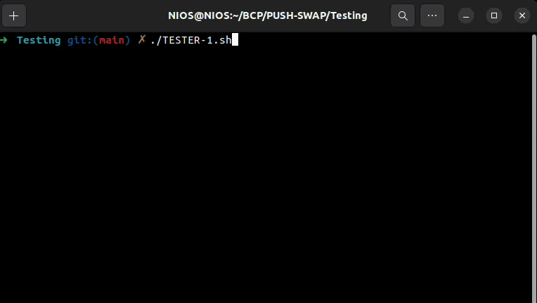

## ABOUT

PUSH_SWAP is a sorting algorithm project written in C as part of the 42 curriculum. The goal of this project is to understand ALGORITHMIC COMPLEXITY, DATA STRUCTURES, and OPTIMIZATION under strict constraints.

This project consists of sorting a list of integers using TWO STACKS and a LIMITED SET OF OPERATIONS, while minimizing the number of instructions. The implementation follows the official SUBJECT and respects THE NORM coding standard.

## REFERENCES

The project follows the official SUBJECT and respects THE NORM coding standard.

SUBJECT: [subject.pdf](./pushswap.pdf)

## INSTALLATION & USAGE

Clone the repository and build the project using MAKE.

```
git clone <your-repo-link>
cd PushSwap
make
```

Run the program using:

```
./push_swap 3 2 1
```

Example:

```
./push_swap 4 67 3 87 23
```

## PROJECT REQUIREMENTS

The only requirements are:

* GNU MAKE (>= 4.3)
* GCC (>= 11.4.0)
* UNIX-BASED SYSTEM (LINUX OR MACOS)

Those versions are the ones used during development.

## CHECKERS

The project includes a CHECKER program that validates if your operations correctly sort the stack.

### USING THE PROVIDED CHECKER

1. Give execution permission to the checker:

```bash

chmod +x checker_linux

```

2. Compile push_swap:

```bash

make

```

3. Run push_swap and pipe the output to the checker:

```bash

ARG="4 67 3 87 23"
./push_swap $ARG | ./checker_linux $ARG

```

4. Expected result:

* `OK` → correctly sorted
* `KO` → incorrect sorting

### USING OUR BONUS CHECKER

The BONUS part includes our OWN IMPLEMENTATION of the checker.

1. Compile the bonus:

```bash

make bonus

```

2. Run push_swap and pipe it to your checker:

```bash

ARG="4 67 3 87 23"
./push_swap $ARG | ./checker_linux $ARG

```

3. Expected result:

* `OK` → correctly sorted
* `KO` → incorrect sorting
* `Error` → invalid input or instruction

## PERFORMANCE

Your algorithm must be OPTIMIZED:

* ≤ 700 operations → EXCELLENT (100 numbers)
* ≤ 1500 operations → GOOD
* ≤ 2000 operations → PASS

## NOTES

* The goal is NOT just sorting, but SORTING WITH MINIMUM OPERATIONS
* ALGORITHM CHOICE is critical (Big-O matters)
* TEST with RANDOM INPUTS for best results
* Always compare with CHECKER

This project teaches how ALGORITHMS SCALE and why OPTIMIZATION MATTERS.
